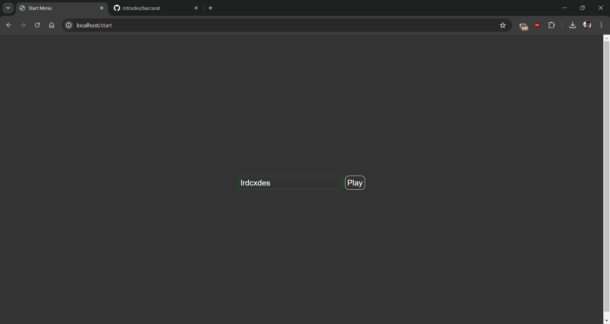
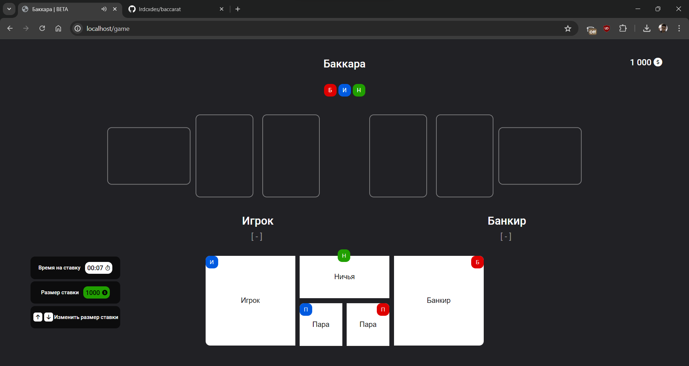
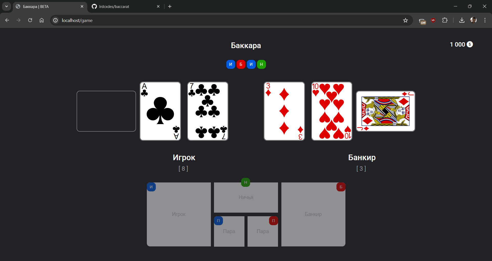
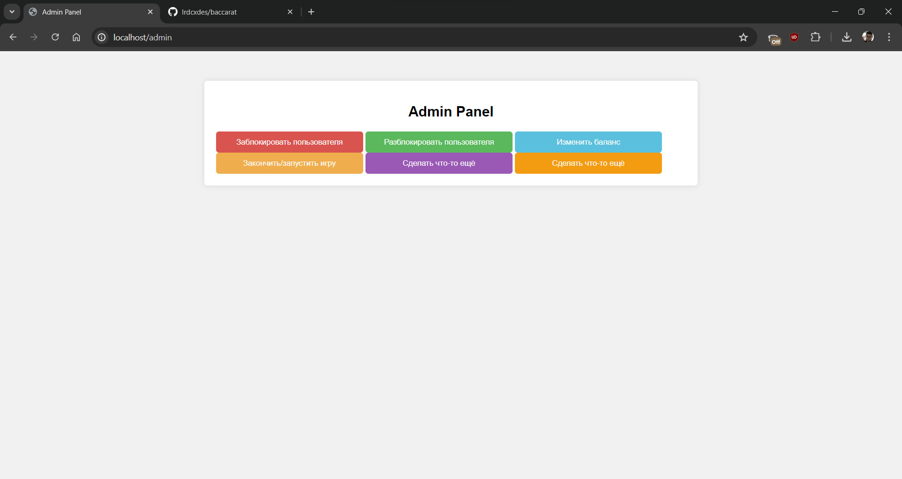

# Baccarat Game

This project is a web-based implementation of the popular card game Baccarat. It allows multiple players to connect and play against the banker. The game is implemented using Python and FastAPI for the backend, and HTML, CSS, and JavaScript for the frontend.

## Features

- Real-time multiplayer gameplay
- Bet placement and balance management
- Game history tracking
- Admin panel for user and game management

## Installation

1. Clone the repository:
```bash
git clone https://github.com/lrdcxdes/baccarat.git
```

2. Navigate to the project directory:
```bash
cd baccarat
```

3. Install the required packages:
```bash
pip install -r requirements.txt
```

4. Create a `.env` file in the project directory with the following
    environment variables:
```env
# Change to your own values
# You can get fontawesome kit 6.5.2 pro from https://fontawesome.com/
FONTAWESOME_URL=/static/fafonts/all.min.css
ADMIN_PASSWORD=admin
```

5. Run the server:
```bash
uvicorn main:app --reload
```

## Usage



1. Open your web browser and navigate to `http://localhost:80/`.
2. Enter your username and click "Play" to join the game.





5. Place your bets and enjoy the game!

## Admin Panel



The admin panel provides additional controls for managing the game and users. To access the admin panel, navigate to `http://localhost:80/admin`.

## Contributing

Contributions are welcome! Please read the [contributing guide](CONTRIBUTING.md) to get started.

## License

This project is licensed under the terms of the MIT license. See the [LICENSE](LICENSE) file for details.
